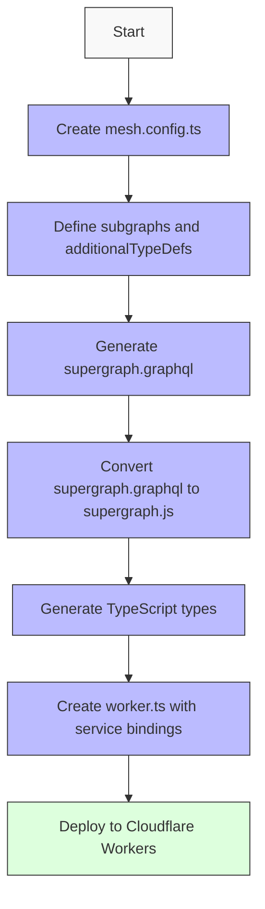
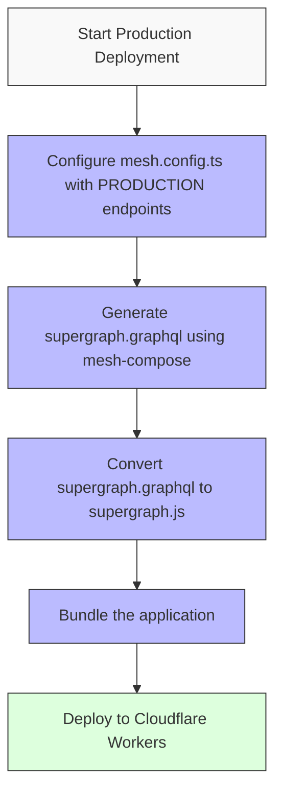
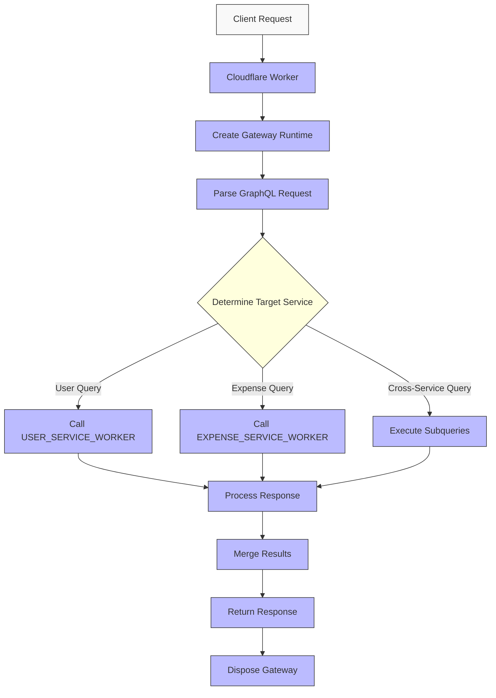
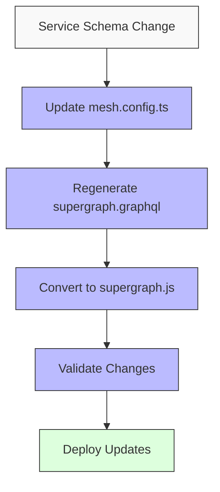

## Deploying Hive Gateway to Cloudflare Workers

### 1. Overview

Hive Gateway provides a cross-platform GraphQL Server that can be integrated into various platforms beyond Node.js. This document outlines the specific implementation details for deploying Hive Gateway to Cloudflare Workers, a serverless execution environment that allows you to create applications without managing infrastructure.

### 2. Implementation Flow

The deployment process for Hive Gateway on Cloudflare Workers differs from traditional deployments due to the serverless nature and specific constraints of the Workers environment.



### 3. Implementation Steps

#### 3.1 Create mesh.config.ts

Create a configuration file that defines all subgraphs and any additional type definitions:

```typescript
// mesh.config.ts
export const composeConfig = defineComposeConfig({
  subgraphs: [
    {
      sourceHandler: loadGraphQLHTTPSubgraph("UserService", {
        endpoint: "http://localhost:7501/graphql",
        method: "POST",
        operationHeaders: {
          "Content-Type": "application/json",
          Accept: "application/json",
        },
        retry: 3,
        timeout: 10000,
      }),
    },
    {
      sourceHandler: loadGraphQLHTTPSubgraph("ExpenseService", {
        endpoint: "http://localhost:7502/graphql",
        method: "POST",
        operationHeaders: {
          "Content-Type": "application/json",
          Accept: "application/json",
        },
        retry: 3,
        timeout: 10000,
      }),
    },
  ],
  additionalTypeDefs: `
    extend type User {
      expenses: [Expense!]!
    }
    extend type Expense {
      user: User!
    }
  `,
});

export const gatewayConfig = defineGatewayConfig({
  additionalResolvers: [additionalResolvers$0],
  cors: { origin: "*", credentials: true },
  plugins: (ctx) => [],
});
```

#### 3.2 Generate Supergraph Schema

Use the mesh-compose tool to generate a supergraph schema:

```bash
mesh-compose -o supergraph.graphql
```

This will create a `supergraph.graphql` file containing the combined schema.

#### 3.3 Convert Supergraph to JavaScript

Since Cloudflare Workers doesn't support Node.js filesystem operations, convert the supergraph schema to a JavaScript file:

```javascript
// supergraph.js
export default /* GraphQL */ `
  # Paste the contents of supergraph.graphql here
`;
```

#### 3.4 Generate TypeScript Types

Use codegen to generate TypeScript types from the supergraph schema:

```bash
graphql-codegen --config codegen.yml
```

With a configuration like:

```yaml
# codegen.yml
generates:
  ./src/types.ts:
    schema: ./supergraph.graphql
    plugins:
      - typescript
      - typescript-resolvers
```

#### 3.5 Create Worker Implementation

Create a `worker.ts` file implementing the Hive Gateway runtime with service bindings:

```typescript
// worker.ts
import { createGatewayRuntime } from "@graphql-hive/gateway-runtime";
import http from "@graphql-mesh/transport-http";
import supergraph from "./supergraph";

export default {
  fetch(request, env, ctx) {
    const gateway = createGatewayRuntime({
      supergraph,
      transports: {
        http, // Required for subgraphs using standard GraphQL over HTTP
      },
      fetchAPI: {
        fetch: (url, options) => {
          // Determine which service to call based on the URL
          if (url.includes(env.USER_SERVICE_URL)) {
            return env.USER_SERVICE_WORKER.fetch(url, options);
          } else if (url.includes(env.EXPENSE_SERVICE_URL)) {
            return env.EXPENSE_SERVICE_WORKER.fetch(url, options);
          }
          // Fallback to default fetch if no match
          return fetch(url, options);
        },
      },
    });

    // Ensure proper disposal of the gateway
    ctx.waitUntil(gateway[Symbol.asyncDispose]());

    return gateway(request, env, ctx);
  },
};
```

### 4. Service Bindings Configuration

When deploying to Cloudflare Workers, configure service bindings in your `wrangler.toml`:

```toml
# wrangler.toml
name = "hive-gateway"
compatibility_date = "2023-01-01"

[vars]
USER_SERVICE_URL = "https://user-service.example.workers.dev"
EXPENSE_SERVICE_URL = "https://expense-service.example.workers.dev"

[[services]]
binding = "USER_SERVICE_WORKER"
service = "user-service"

[[services]]
binding = "EXPENSE_SERVICE_WORKER"
service = "expense-service"
```

### 5. Production Deployment Process

Since we are not using the Hive Gateway registry service, the production deployment requires a manual process to create and manage the supergraph schema:



#### 5.1 Pre-Build Supergraph for Production

For production deployments, follow these steps:

1. **Set Production Environment Variables**:

   ```bash
   export USER_SERVICE_URL=https://prod-user-service.workers.dev
   export EXPENSE_SERVICE_URL=https://prod-expense-service.workers.dev
   ```

2. **Generate Production Supergraph**:

   ```bash
   NODE_ENV=mesh-compose -o supergraph.graphql
   ```

3. **Convert to JavaScript Module**:

```javascript
// supergraph.js
export default /* GraphQL */ `
  # Paste the contents of production supergraph.graphql here
`;
```

4. **Build and Deploy**:
   ```bash
   npm run build
   wrangler publish
   ```

### 6. Gateway Runtime Flow



### 7. Special Considerations for Cloudflare Workers

1. **No Filesystem Access**: Cloudflare Workers doesn't support Node.js `fs` module, requiring precompilation of the supergraph schema.

2. **Service Bindings**: Use service bindings to call other Worker services within your organization.

3. **Resource Management**: Implement proper async disposal of the gateway runtime to prevent resource leaks.

4. **Environment Variables**: Define environment variables in `wrangler.toml` for service URLs and other configuration.

5. **Size Limitations**: Be mindful of the Workers size limits.

### 8. Performance Optimizations

1. **Caching**: Implement caching strategies for frequently accessed data.

2. **Query Complexity Analysis**: Consider implementing query complexity analysis to prevent resource-intensive queries.

3. **Timeout Handling**: Implement proper timeout handling for service calls.

4. **Error Handling**: Implement comprehensive error handling and reporting.

### 9. Monitoring and Observability

1. **Logs**: Use Cloudflare Workers logs for debugging and monitoring.

2. **Tracing**: Consider implementing distributed tracing for cross-service requests.

### 10. Schema Update Process



When underlying service schemas change, follow this process:

1. Update the service schema and deploy the updated service
2. Update mesh.config.ts with any new type extensions or relationship definitions
3. Regenerate the supergraph schema
4. Convert to supergraph.js
5. Validate the changes with test queries
6. Deploy the updated gateway

For detailed implementation instructions, refer to the [Hive Gateway Cloudflare Workers documentation](https://the-guild.dev/graphql/hive/docs/gateway/deployment/serverless/cloudflare-workers).
