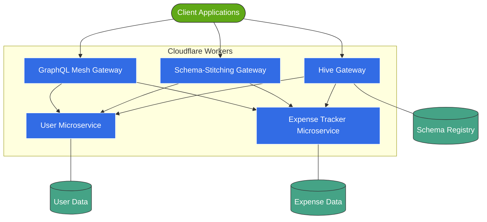
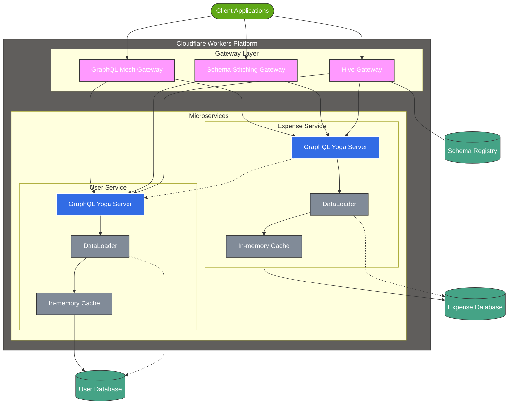
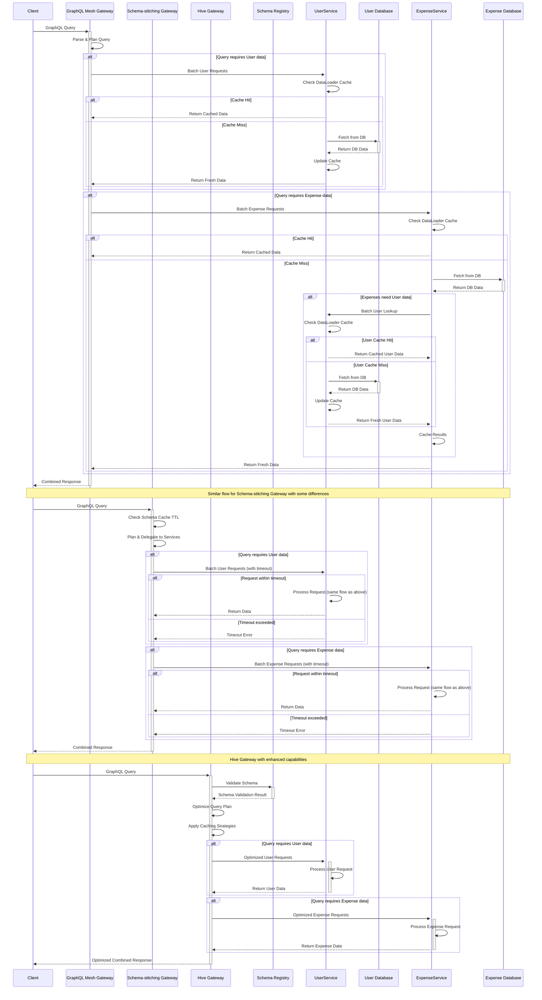

# High-Level Design (HLD) - GraphQL Gateway Microservices - Architecture Documentation

### 1.1 System Overview

The system implements a GraphQL gateway that connects two microservices built with Cloudflare Workers:

1. **User Microservice**: Manages user information and accounts with optimized data fetching
2. **Expense Tracker Microservice**: Tracks daily expenses linked to specific users with optimized data fetching

The project implements three gateway approaches for comparison:

1. **GraphQL Mesh Gateway**: Automatically generates a unified schema
2. **Schema-Stitching Gateway**: Manually connects schemas using graphql-tools
3. **Hive Gateway**: Provides a fully managed GraphQL gateway solution with advanced features

### 1.2 Architecture Diagram

- Basic Architecture Diagram

- High-Level Design Architecture Diagram

### 1.3 Key Components

#### 1.3.1 GraphQL Mesh Gateway

- **Purpose**: Acts as a unified entry point for client requests
- **Technology**: GraphQL Mesh, Cloudflare Workers
- **Responsibility**: Automated schema stitching, type merging, request routing
- **Optimization**: Implements DataLoader for batching and caching
- **Prebuild Process**: Generates a prebuilt `.mesh` file for deployment

#### 1.3.2 Schema-Stitching Gateway

- **Purpose**: Provides an alternative approach to schema composition
- **Technology**: graphql-tools, Cloudflare Workers
- **Responsibility**: Manual schema stitching, federation setup
- **Optimization**: Configures schema cache TTL and service executor timeouts

#### 1.3.3 Hive Gateway

- **Purpose**: Provides a fully managed, feature-rich GraphQL gateway solution
- **Technology**: Hive Gateway, Cloudflare Workers
- **Responsibility**: Schema registry integration, schema validation, query planning, monitoring
- **Key Features**:
  - Centralized schema management via Schema Registry
  - Intelligent request routing and caching strategies
  - Automatic schema updates and versioning

#### 1.3.4 User Microservice

- **Purpose**: Manages user data and operations
- **Technology**: GraphQL Yoga, Cloudflare Workers
- **Responsibility**: CRUD operations for user entities
- **Optimization**: Implements in-memory caching and DataLoader

#### 1.3.5 Expense Tracker Microservice

- **Purpose**: Manages expense records linked to users
- **Technology**: GraphQL Yoga, Cloudflare Workers
- **Responsibility**: CRUD operations for expense entities
- **Optimization**: Implements in-memory caching and DataLoader

### 1.4 Data Flow Sequence

### 1.5 Cross-Cutting Concerns

- **Caching**: Implemented at multiple levels (gateway, service, DataLoader)
- **Batching**: Achieved through DataLoader implementation
- **Monitoring**: Worker analytics and custom metrics
- **Performance Optimization**: Designed to minimize redundant lookups
- **Schema Management**: Centralized via Hive Schema Registry for the Hive Gateway implementation

## 1.6 Hive Gateway Serverless Deployment Strategy

### 1.6.1 Cloudflare Workers Deployment

The GraphQL Gateway utilizes Hive Gateway deployed on Cloudflare Workers to provide a serverless, globally distributed entry point for the application. This deployment strategy offers several architectural advantages:

- **Global Distribution**: Automatically deployed to Cloudflare's global edge network for low-latency responses
- **Serverless Execution**: No infrastructure management required, with auto-scaling based on demand
- **Service Mesh Integration**: Direct service-to-service communication through Cloudflare Workers service bindings

### 1.6.2 Architectural Considerations

The serverless gateway architecture introduces specific considerations:

1. **Pre-compiled Schema**: The supergraph schema must be pre-compiled during the build process due to serverless constraints
2. **Cross-Service Communication**: Service bindings are used for direct worker-to-worker communication, reducing network latency
3. **Deployment Pipeline**: Schema generation is integrated into the CI/CD pipeline to ensure consistency between environments
4. **Schema Updates**: Schema changes require a coordinated deployment strategy across services

### 1.6.3 Resilience Strategy

The gateway implements several strategies to ensure resilience in the serverless environment:

- **Graceful Degradation**: Services can operate independently if other services are unavailable
- **Query Optimization**: Automatic query planning to minimize cross-service requests
- **Response Caching**: Strategic caching at the edge for frequently requested data
- **Resource Management**: Proper disposal of resources to optimize serverless execution

For implementation details, refer to the comprehensive Hive Gateway Cloudflare Workers documentation.
