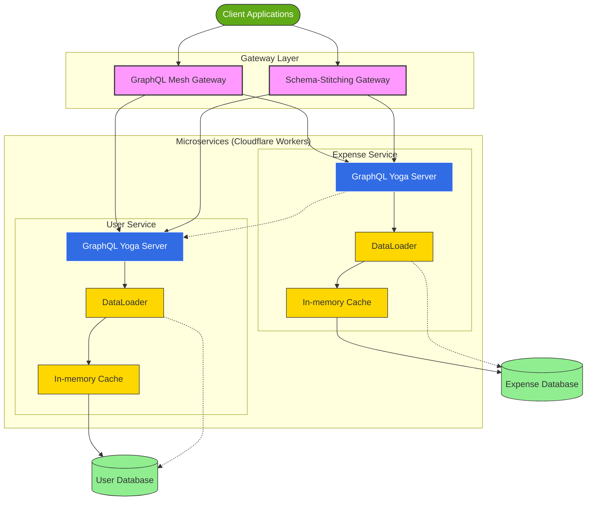
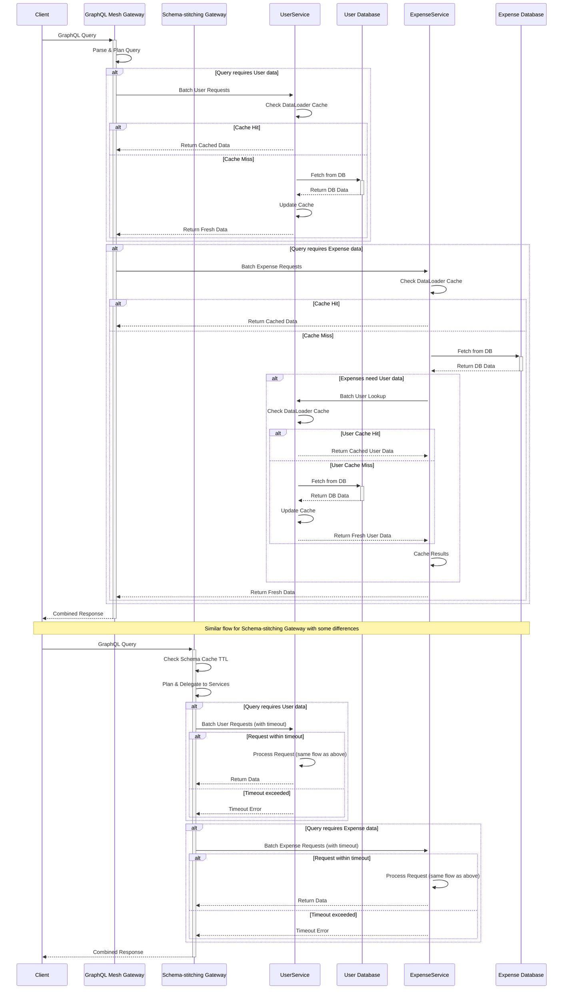

# High-Level Design (HLD) - GraphQL Gateway Microservices - Architecture Documentation

### 1.1 System Overview

The system implements a GraphQL gateway that connects two microservices built with Cloudflare Workers:

1. **User Microservice**: Manages user information and accounts with optimized data fetching
2. **Expense Tracker Microservice**: Tracks daily expenses linked to specific users with optimized data fetching

The project implements two gateway approaches for comparison:

1. **GraphQL Mesh Gateway**: Automatically generates a unified schema
2. **Schema-Stitching Gateway**: Manually connects schemas using graphql-tools

### 1.2 Architecture Diagram

- Basic Architecture Diagram

- High-Level Design Architecture Diagram

### 1.3 Key Components

#### 1.3.1 GraphQL Mesh Gateway

- **Purpose**: Acts as a unified entry point for client requests
- **Technology**: GraphQL Mesh, Cloudflare Workers
- **Responsibility**: Automated schema stitching, type merging, request routing
- **Optimization**: Implements DataLoader for batching and caching
- **Prebuild Process**: Generates a prebuilt `.mesh` file for deployment

#### 1.3.2 Schema-Stitching Gateway

- **Purpose**: Provides an alternative approach to schema composition
- **Technology**: graphql-tools, Cloudflare Workers
- **Responsibility**: Manual schema stitching, federation setup
- **Optimization**: Configures schema cache TTL and service executor timeouts

#### 1.3.3 User Microservice

- **Purpose**: Manages user data and operations
- **Technology**: GraphQL Yoga, Cloudflare Workers
- **Responsibility**: CRUD operations for user entities
- **Optimization**: Implements in-memory caching and DataLoader

#### 1.3.4 Expense Tracker Microservice

- **Purpose**: Manages expense records linked to users
- **Technology**: GraphQL Yoga, Cloudflare Workers
- **Responsibility**: CRUD operations for expense entities
- **Optimization**: Implements in-memory caching and DataLoader

### 1.4 Data Flow Sequence

### 1.5 Cross-Cutting Concerns

- **Caching**: Implemented at multiple levels (gateway, service, DataLoader)
- **Batching**: Achieved through DataLoader implementation
- **Monitoring**: Worker analytics and custom metrics
- **Performance Optimization**: Designed to minimize redundant lookups
