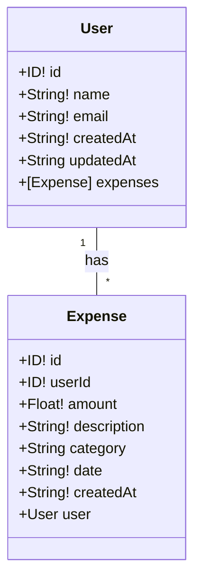
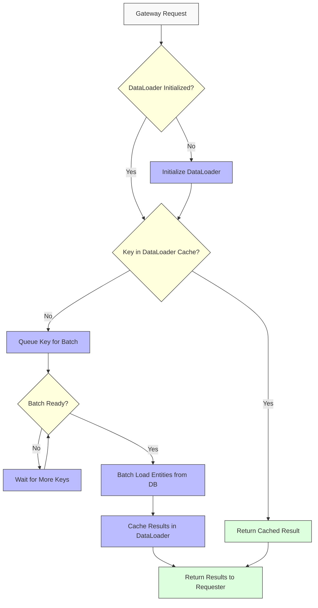
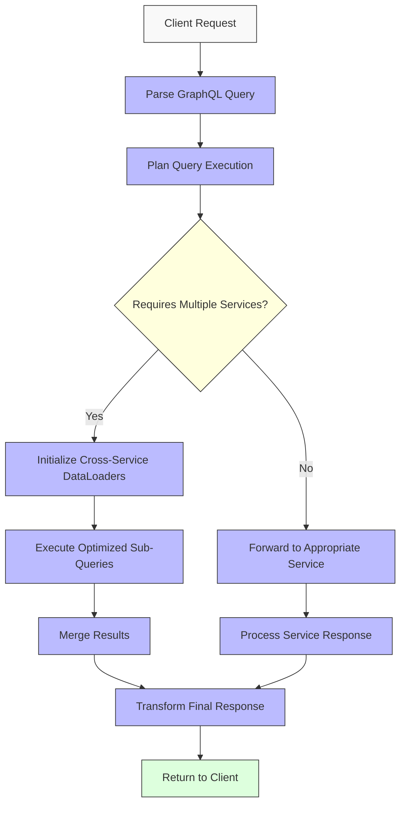
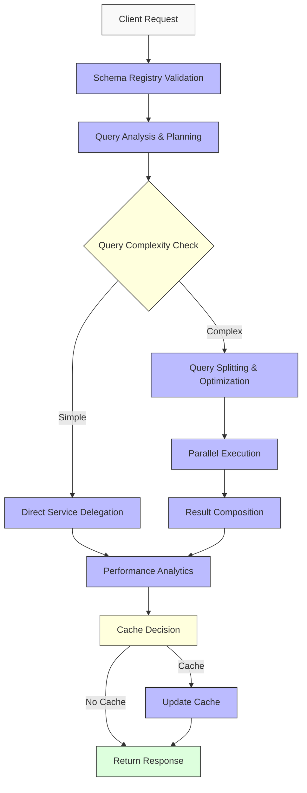

## Low-Level Design (LLD) - GraphQL Gateway Microservices - Architecture Documentation

### 1.1 GraphQL Schema Details

#### 1.1.1 Gateway Schema (Combined)



#### 1.1.2 User Microservice Schema

```graphql
type User {
  id: ID!
  name: String!
  email: String!
  createdAt: String!
  updatedAt: String
}

type Query {
  user(id: ID!): User
  users(ids: [ID!]!): [User]!
  allUsers: [User]
}

type Mutation {
  createUser(name: String!, email: String!): User
  updateUser(id: ID!, name: String, email: String): User
  deleteUser(id: ID!): Boolean
}
```

#### 1.1.3 Expense Microservice Schema

```graphql
type Expense {
  id: ID!
  userId: ID!
  amount: Float!
  description: String!
  category: String
  date: String!
  createdAt: String!
}

type Query {
  expense(id: ID!): Expense
  expenses: [Expense]
  expensesByUser(userId: ID!): [Expense]
  expensesByUsers(userIds: [ID!]!): [Expense]! # New batch endpoint
  expensesByDate(startDate: String!, endDate: String): [Expense]
}

type Mutation {
  createExpense(userId: ID!, amount: Float!, description: String!, category: String, date: String!): Expense
  updateExpense(id: ID!, amount: Float, description: String, category: String): Expense
  deleteExpense(id: ID!): Boolean
}
```

### 1.2 Gateway Implementation Details

#### 1.2.1 GraphQL Mesh Gateway Structure

- **Mesh Configuration**: Defines sources, type relationships, and additional resolvers
- **Additional Resolvers**: Implements DataLoaders for efficient cross-service data fetching
- **Build Process**: Pre-generates a unified schema for deployment
- **Optimization**: Focuses on minimizing redundant lookups through batching and caching

#### 1.2.2 Schema-Stitching Gateway Structure

- **Schema Handling**: Manually loads and stitches remote schemas
- **Executor Design**: Implements service executors with timeout configurations
- **Type Extensions**: Explicitly defines cross-service type relationships
- **Resolver Strategy**: Uses delegation pattern to route queries to appropriate services
- **Performance Settings**: Configures schema caching TTL for reuse across requests

#### 1.2.3 Hive Gateway Structure

- **Schema Registry Integration**: Centralizes schema management and versioning
- **Query Planning**: Implements intelligent query planning and optimization
- **Request Routing**: Advanced routing strategies based on schema capabilities
- **Caching Strategy**: Multi-level caching with intelligent invalidation
- **Automatic Updates**: Self-healing schema composition and updates

### 1.3 Microservice Structure

#### 1.3.1 User Microservice Architecture

- **Caching Layer**: In-memory cache for frequently accessed users
- **DataLoader Implementation**: Batches and deduplicates user ID lookups
- **Schema Definition**: Self-contained GraphQL schema for user operations
- **Resolver Architecture**: Implements optimized query handling with cache checks

#### 1.3.2 Expense Microservice Architecture

- **Caching Layer**: In-memory cache for expenses and user-grouped expenses
- **DataLoader Implementation**: Multiple DataLoaders for different access patterns
- **Schema Definition**: Self-contained GraphQL schema for expense operations
- **Optimizer**: Implements expense grouping by user for efficient cross-service resolution

### 1.4 Access Patterns & Responsibilities

#### 1.4.1 User Microservice Access Patterns

| Operation      | Access Pattern                  | Responsibility                                     | Optimization                             |
| -------------- | ------------------------------- | -------------------------------------------------- | ---------------------------------------- |
| Get User by ID | Direct key lookup               | Retrieve a specific user by unique ID              | DataLoader for batching; In-memory cache |
| List All Users | Scan/List operation             | Retrieve all users (with pagination in production) | Result caching with TTL                  |
| Create User    | Write operation with validation | Create a new user with required fields             | Cache invalidation                       |
| Update User    | Conditional write operation     | Update specific fields of an existing user         | Selective cache updates                  |
| Delete User    | Key deletion                    | Remove a user from the system                      | Cache invalidation                       |

#### 1.4.2 Expense Microservice Access Patterns

| Operation                  | Access Pattern                  | Responsibility                                        | Optimization                             |
| -------------------------- | ------------------------------- | ----------------------------------------------------- | ---------------------------------------- |
| Get Expense by ID          | Direct key lookup               | Retrieve a specific expense by unique ID              | DataLoader for batching; In-memory cache |
| List All Expenses          | Scan/List operation             | Retrieve all expenses (with pagination in production) | Result caching with TTL                  |
| Get Expenses by User       | Secondary index query           | Retrieve all expenses for a specific user             | User-grouped expense DataLoader          |
| Get Expenses by Date Range | Range query                     | Retrieve expenses within a date range                 | Filtered cache results                   |
| Create Expense             | Write operation with validation | Create a new expense with required fields             | Cache invalidation                       |
| Update Expense             | Conditional write operation     | Update specific fields of an expense                  | Selective cache updates                  |
| Delete Expense             | Key deletion                    | Remove an expense from the system                     | Cache invalidation                       |

#### 1.4.3 Gateway Access Patterns

| Gateway Type     | Operation Type      | Access Pattern                   | Optimization                    |
| ---------------- | ------------------- | -------------------------------- | ------------------------------- |
| GraphQL Mesh     | Simple Query        | Direct delegation                | Schema                          |
| GraphQL Mesh     | Cross-Service Query | Type merging with DataLoader     | Batched service calls           |
| Schema-Stitching | Simple Query        | Direct delegation                | Schema caching                  |
| Schema-Stitching | Cross-Service Query | Info delegation with fragment    | Explicit type resolution        |
| Hive Gateway     | Simple Query        | Direct delegation with analytics | Schema Registry validation      |
| Hive Gateway     | Cross-Service Query | Query planning and optimization  | Intelligent request splitting   |
| Hive Gateway     | Schema Updates      | Automatic schema composition     | Version-aware schema resolution |

### 1.5 Optimization Strategies

#### 1.5.1 Data Loading Optimization



#### 1.5.2 Caching Implementation Strategy

| Layer      | Cache Type   | Scope         | TTL                 | Invalidation Strategy  |
| ---------- | ------------ | ------------- | ------------------- | ---------------------- |
| Gateway    | Schema Cache | Global        | 5 minutes           | Time-based expiration  |
| Service    | In-Memory    | Request       | Duration of request | N/A (request-scoped)   |
| DataLoader | In-Memory    | Request       | Duration of request | N/A (request-scoped)   |
| Results    | In-Memory    | Cross-Request | Configurable        | On mutation operations |
| Hive       | Multi-level  | Tiered        | Adaptive            | Smart invalidation     |

#### 1.5.3 Request Processing Flow



#### 1.5.4 Hive Gateway Optimization Flow



### 1.6 Error Handling Strategy

| Error Type           | Handling Approach     | Responsibility |
| -------------------- | --------------------- | -------------- |
| Service Unavailable  | Circuit Breaking      | Gateway        |
| Invalid Request      | Schema Validation     | Gateway        |
| Business Logic Error | Domain-Specific Error | Microservice   |
| Timeout              | Graceful Degradation  | Gateway        |
| Data Consistency     | Compensating Action   | Microservice   |
| Schema Conflicts     | Version Resolution    | Hive Gateway   |
| Performance Issues   | Adaptive Throttling   | Hive Gateway   |

### 1.7 Deployment Configuration

#### 1.7.1 Environment Variables

| Component        | Variable                 | Purpose                  | Default |
| ---------------- | ------------------------ | ------------------------ | ------- |
| Mesh Gateway     | SERVICE_USER_ENDPOINT    | User service URL         | N/A     |
| Mesh Gateway     | SERVICE_EXPENSE_ENDPOINT | Expense service URL      | N/A     |
| Schema-Stitching | CACHE_TTL                | Cache timeout in seconds | 300     |
| Schema-Stitching | SERVICE_TIMEOUT_MS       | Service call timeout     | 5000    |
| User Service     | CACHE_ENABLED            | Toggle caching           | true    |
| Expense Service  | BATCH_SIZE               | DataLoader batch size    | 20      |

### 1.8 Hive Gateway Cloudflare Workers Deployment

Hive Gateway can be deployed to Cloudflare Workers for a serverless implementation. This deployment strategy differs from traditional approaches due to the constraints of the Workers environment.

#### 1.8.1 Key Implementation Steps

1. **Configuration**: Define subgraphs and relationships in mesh.config.ts
2. **Supergraph Generation**: Pre-build the supergraph schema for deployment
3. **Service Binding**: Implement service bindings for inter-service communication
4. **Resource Management**: Utilize proper async disposal for the gateway runtime

#### 1.8.2 Production Considerations

| Component                   | Consideration         | Approach                              |
| --------------------------- | --------------------- | ------------------------------------- |
| Schema Updates              | No filesystem access  | Pre-build supergraph.js file          |
| Inter-service Communication | Service isolation     | Cloudflare service bindings           |
| Resource Management         | Memory constraints    | Proper async disposal                 |
| Deployment                  | Manual schema updates | CI/CD pipeline with schema generation |

For detailed implementation instructions, refer to the [Hive Gateway Cloudflare Workers documentation](https://the-guild.dev/graphql/hive/docs/gateway/deployment/serverless/cloudflare-workers).
